# Sensationalism Values Ontology - Documentation

**File**: `ontology/sensationalism-values.ttl`
**Worldview**: Sensationalism (Material-Empirical Cluster)
**Date**: December 21, 2025
**Status**: ✅ Complete with ValueNet Integration

---

## 🎯 Overview

The **Sensationalism** worldview grounds all value in **immediate sensory experience** and **qualitative richness**. Unlike materialism (which prioritizes physical substrate) or phenomenalism (which prioritizes validity of appearances), sensationalism makes **felt qualities (qualia)** the fundamental reality.

### Core Thesis

**"Reality is constituted by sensory experiences, and value derives from experiential intensity and aesthetic beauty."**

---

## 📊 Value Hierarchy

### Terminal Values (Highest Goods)

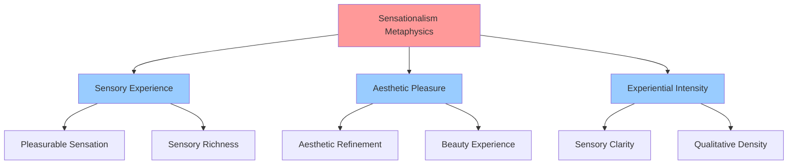

#### 1. **Sensory Experience** (Ultimate Terminal Value)
- **Definition**: The richness and intensity of immediate sensory encounters
- **Manifestations**: Pleasurable sensations, aesthetic encounters, sensory richness
- **Why Terminal**: Sensationalism holds that immediate felt qualities are the only directly given reality
- **Salience**: Very High

#### 2. **Aesthetic Pleasure** (Refined Terminal Value)
- **Definition**: Experience of beauty through refined sensory perception
- **Manifestations**: Beauty experience, harmonic sensation, artistic encounter
- **Why Terminal**: Represents cultivated sensationalism - not mere sensation but refined appreciation
- **Salience**: Very High

#### 3. **Experiential Intensity** (Qualitative Terminal Value)
- **Definition**: Degree of qualitative richness and vividness in sensory experience
- **Measured By**: Qualitative density, sensory vividness (not duration or quantity)
- **Why Terminal**: Values quality over quantity of experience
- **Salience**: High

---

## 🔗 ValueNet Integration

### Disposition Mapping Architecture

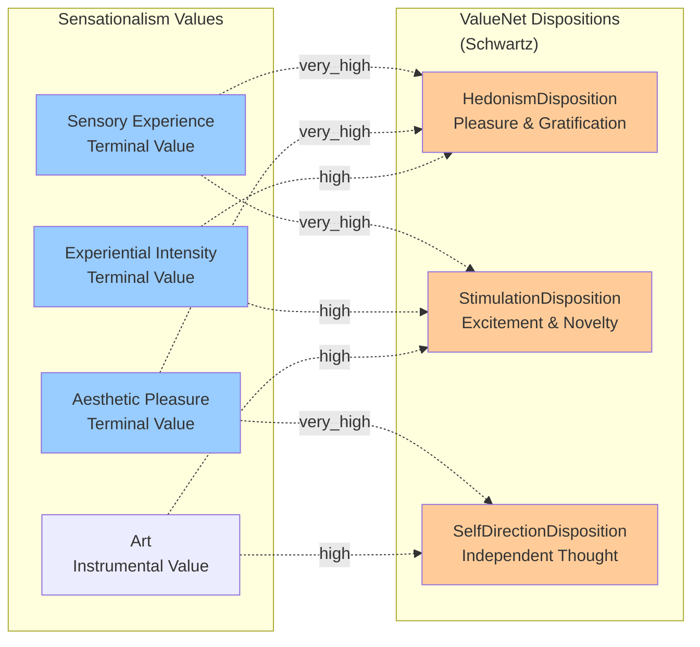

### Primary Mappings

| Sensationalism Value | ValueNet Disposition | Salience | Grounding |
|---------------------|---------------------|----------|-----------|
| **Sensory Experience** | HedonismDisposition | very_high | Direct pleasure-seeking in immediate sensation |
| **Sensory Experience** | StimulationDisposition | very_high | Novelty and excitement in sensory encounters |
| **Aesthetic Pleasure** | HedonismDisposition | very_high | Pleasure in refined aesthetic quality |
| **Aesthetic Pleasure** | SelfDirectionDisposition | very_high | Autonomous cultivation of taste |
| **Experiential Intensity** | StimulationDisposition | high | Seeking vivid, novel experiences |
| **Art** | SelfDirectionDisposition | high | Creative autonomy in aesthetic creation |

### Key Insight: Multi-Perspectival Interpretation

The **same ValueNet disposition** has **different meanings** across worldviews:

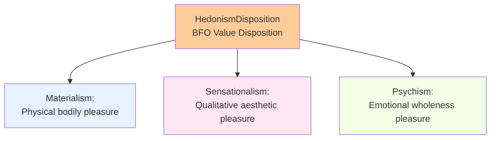

**HedonismDisposition across worldviews**:
- **Materialism**: Physical/bodily pleasure (material substrate)
- **Sensationalism**: Aesthetic/qualitative pleasure (immediate qualia)
- **Psychism**: Emotional/psychological pleasure (depth integration)

---

## 🧩 BFO Alignment Patterns

### Quality Substrates

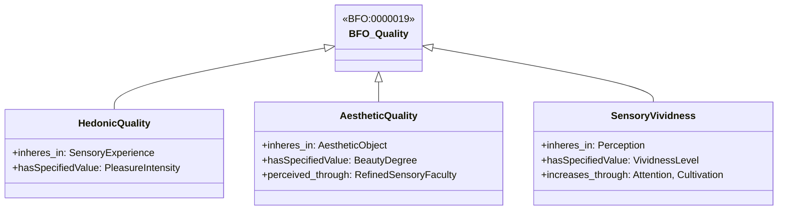

**BFO Pattern**: Values ground in **quality substrates** that inhere in experiences/objects.

### Processes Realizing Values

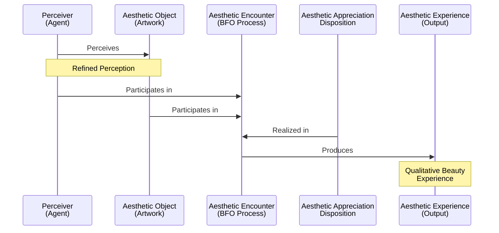

**BFO Process Pattern**:
1. **Disposition** (Aesthetic Appreciation) inheres in Perceiver
2. **Process** (Aesthetic Encounter) realizes the disposition
3. **Participants**: Perceiver and Aesthetic Object
4. **Output**: Aesthetic Experience with quality substrates

### Disposition Realization

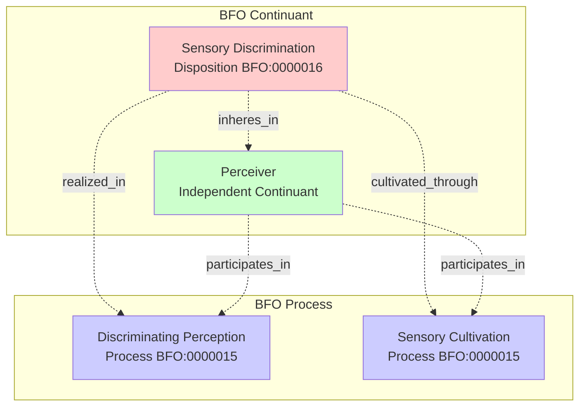

---

## 🎨 Philosophical Foundations

### Metaphysical Commitments

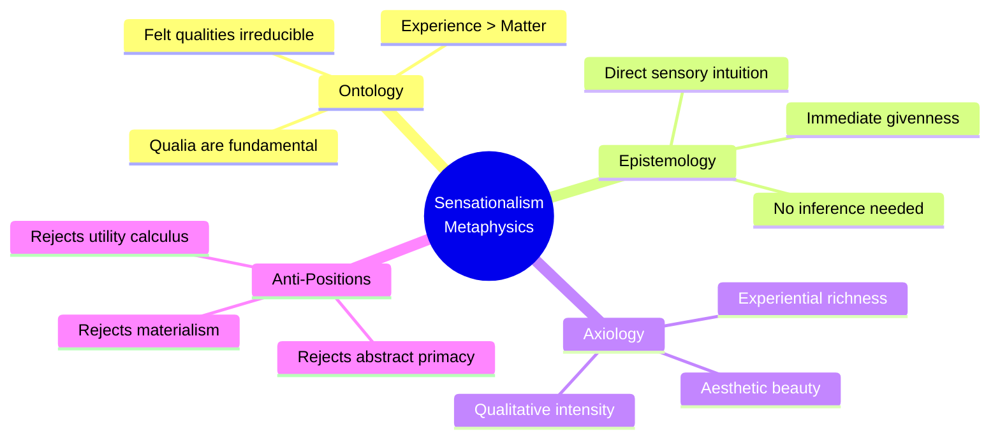

### Key Distinctions

#### Sensationalism vs. Materialism

| Dimension | Materialism | Sensationalism |
|-----------|-------------|----------------|
| **Fundamental Reality** | Physical matter | Sensory experience (qualia) |
| **Epistemic Access** | Empirical measurement | Immediate felt quality |
| **Value Ground** | Physical wellbeing | Experiential richness |
| **Consciousness** | Epiphenomenal/reducible | Fundamental/irreducible |
| **Example Priority** | Physical health | Aesthetic pleasure |

#### Sensationalism vs. Phenomenalism

| Dimension | Phenomenalism | Sensationalism |
|-----------|---------------|----------------|
| **Primary Concern** | **Validity** of appearances (epistemic) | **Quality** of sensations (axiological) |
| **Focus** | Truth and certainty | Beauty and pleasure |
| **Method** | Bracketing, reduction | Cultivation, refinement |
| **Values** | Subjective certainty | Experiential intensity |
| **Example** | "Is this perception valid?" | "Is this sensation beautiful?" |

---

## 📐 Value Hierarchy Diagram

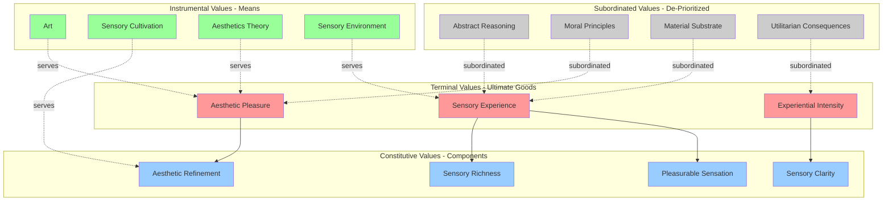

---

## 💡 Example Scenarios

### Example 1: Wine Tasting

```turtle
:WineTastingScenario a :Scenario ;
    :action "taste_fine_wine" ;
    :context [
        :aesthetic true ;
        :sensory true ;
        :cultivated true ;
        :immediate_experience true
    ] ;
    :sensationalistEvaluation [
        :judgment "highly_good" ;
        :reasoning "Wine tasting realizes core sensationalist values:
                    refined sensory experience, aesthetic pleasure,
                    cultivated taste" ;
        :relevantValues :SensoryExperience, :AestheticPleasure,
                        :SensoryCultivation ;
        :confidence 0.95
    ] .
```

**Why Highly Valued**:
- Direct sensory richness (complex flavors, aromas)
- Aesthetic refinement (cultivated taste)
- Immediate experiential quality
- Realizes HedonismDisposition and SelfDirectionDisposition

**Evaluation Flow**:
```mermaid
graph LR
    A[Wine Tasting Action] --> B{Matches Values?}
    B --> C[Sensory Experience: ✓✓✓]
    B --> D[Aesthetic Pleasure: ✓✓✓]
    B --> E[Cultivation: ✓✓]
    C --> F[Judgment: Highly Good]
    D --> F
    E --> F
    F --> G[Confidence: 95%]

    style C fill:#99ff99
    style D fill:#99ff99
    style E fill:#99ff99
    style F fill:#ffcc99
```

---

### Example 2: Mathematical Proof

```turtle
:MathematicalProofScenario a :Scenario ;
    :action "prove_theorem" ;
    :context [
        :abstract true ;
        :logical true ;
        :non_sensory true
    ] ;
    :sensationalistEvaluation [
        :judgment "neutral_to_low" ;
        :reasoning "Mathematical reasoning is abstract, lacks immediate
                    sensory quality; valued only if experienced as
                    elegant (aesthetic) or intellectually stimulating" ;
        :relevantValues :AbstractReasoning (subordinated) ;
        :conflicts "Abstract logic vs. immediate sensory experience" ;
        :confidence 0.7
    ] .
```

**Why Low Value**:
- Lacks immediate sensory quality
- Abstract reasoning subordinated
- No aesthetic beauty (unless proof is "elegant")
- Low HedonismDisposition, low StimulationDisposition

**Evaluation Flow**:
```mermaid
graph LR
    A[Mathematical Proof] --> B{Matches Values?}
    B --> C[Sensory Experience: ✗]
    B --> D[Abstract Reasoning: subordinated]
    B --> E[Aesthetic? Only if elegant]
    C --> F[Judgment: Neutral-Low]
    D --> F
    E -.maybe.-> F
    F --> G[Confidence: 70%]

    style C fill:#ffcccc
    style D fill:#ffcccc
    style E fill:#ffffcc
    style F fill:#ffcc99
```

---

### Example 3: Charitable Donation

```turtle
:CharitableDonationScenario a :Scenario ;
    :action "donate_to_charity" ;
    :context [
        :moral true ;
        :abstract_consequences true ;
        :emotional_feeling true
    ] ;
    :sensationalistEvaluation [
        :judgment "neutral_to_positive" ;
        :reasoning "Valued primarily for warm emotional feeling
                    (sensory quality), not for abstract moral duty
                    or calculated utility" ;
        :relevantValues :PleasurableSensation (emotional warmth),
                        :MoralPrinciples (subordinated) ;
        :confidence 0.6
    ] .
```

**Why Neutral-Positive**:
- Emotional warmth is a pleasurable sensation (hedonic quality)
- Moral duty is subordinated (abstract principle)
- Utility calculation ignored (future consequences)
- Moderate HedonismDisposition (emotional pleasure)

---

## 🔄 Multi-Worldview Comparison

### Same Action, Different Worldview Evaluations

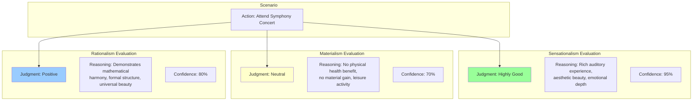

**Key Insight**: Same action receives radically different evaluations based on metaphysical foundations.

---

## 🧠 Cognitive Architecture

### How Sensationalism Evaluates

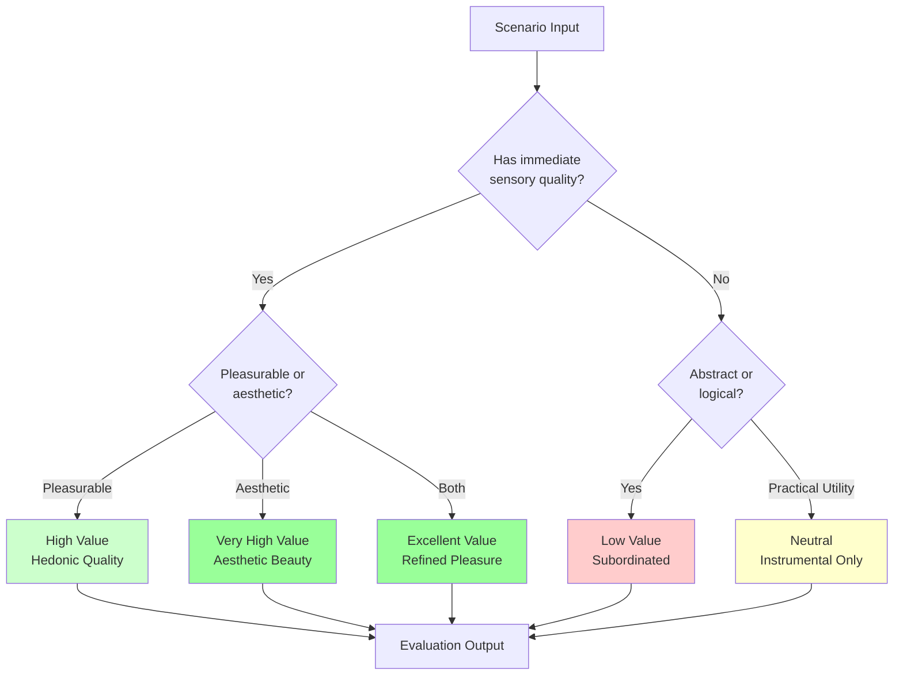

---

## 🎭 Worldview Tensions

### Complementary Pair: Sensationalism ↔ Rationalism

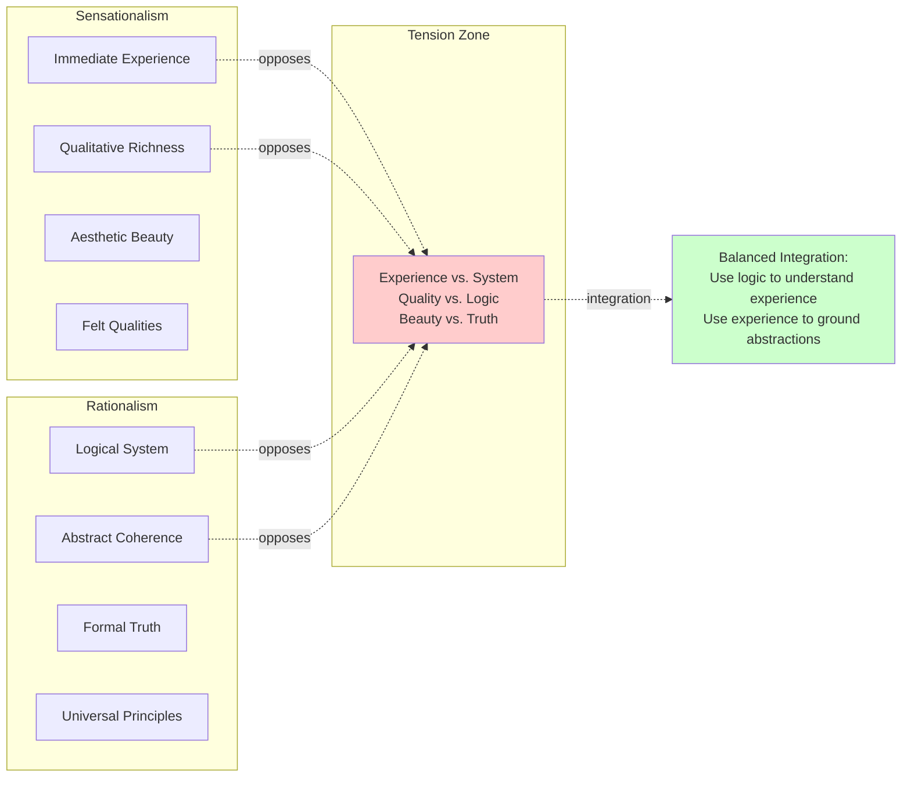

**Integration Strategy**:
- **Acknowledge both**: Immediate experience provides content; logic provides structure
- **Context matters**: Art domain favors sensationalism; mathematics favors rationalism
- **Synthesis**: Aesthetic logic, experiential mathematics (e.g., visual proofs)

---

## 📊 Salience Matrix

### ValueNet Disposition Salience in Sensationalism

| ValueNet Disposition | Salience | Grounding |
|---------------------|----------|-----------|
| **HedonismDisposition** | ⭐⭐⭐⭐⭐ Very High | Core value: immediate pleasure in experience |
| **StimulationDisposition** | ⭐⭐⭐⭐⭐ Very High | Core value: novelty, excitement, vividness |
| **SelfDirectionDisposition** | ⭐⭐⭐⭐ High | Autonomous aesthetic cultivation |
| **UniversalismDisposition** | ⭐⭐ Low | Aesthetic beauty has universal quality, but subordinated to individual taste |
| **AchievementDisposition** | ⭐ Very Low | Achievement subordinated unless artistic |
| **PowerDisposition** | ⭐ Very Low | Social power irrelevant to aesthetic experience |
| **SecurityDisposition** | ⭐ Very Low | Material security subordinated to experiential quality |
| **ConformityDisposition** | ❌ Incompatible | Conformity opposes authentic aesthetic experience |
| **TraditionDisposition** | ❌ Incompatible | Traditional norms oppose individual sensory cultivation |
| **BenevolenceDisposition** | ⭐⭐ Low | Compassion as emotional sensation, not duty |

---

## 🔍 Technical Details

### Turtle/RDF Structure

```turtle
# Core pattern: Terminal Value → Constitutive Values → Instrumental Values

:SensoryExperience a :TerminalValue ;
    :groundedIn :Sensationalism ;
    :manifestsAs :PleasurableSensation, :SensoryRichness ;
    :realizableAs vn-schwartz:HedonismDisposition ;
    :salience "very_high" .

:PleasurableSensation a :ConstitutiveValue ;
    :constitutes :SensoryExperience ;
    :measuredBy :PleasureIntensity .

:Art a :InstrumentalValue ;
    :servesValue :AestheticPleasure, :SensoryRichness ;
    :realizableAs vn-schwartz:SelfDirectionDisposition .
```

### BFO Class Hierarchy

```
bfo:Entity
├── bfo:Continuant
│   ├── bfo:IndependentContinuant
│   │   └── :Perceiver
│   │   └── :AestheticObject
│   └── bfo:SpecificallyDependentContinuant
│       ├── bfo:Quality
│       │   └── :HedonicQuality
│       │   └── :AestheticQuality
│       │   └── :Qualia
│       └── bfo:Disposition
│           └── :AestheticAppreciationDisposition
│           └── :SensoryDiscriminationDisposition
└── bfo:Occurrent
    └── bfo:Process
        └── :AestheticEncounter
        └── :SensoryCultivationProcess
```

---

## 🚀 Usage in IEE

### Loading Sensationalism Values

```javascript
import { worldviewManager } from './src/concepts/worldviewManager.js';
import { ontologyLoader } from './src/concepts/ontologyLoader.js';

// Load ontology
await ontologyLoader.actions.loadTTL('ontology/sensationalism-values.ttl');

// Load worldview programmatically
worldviewManager.actions.loadWorldview('sensationalism', {
  foundation: 'sensory_experience',
  primacy: 'qualitative_immediacy',
  epistemology: 'direct_sensory_intuition'
});

// Activate for evaluation
worldviewManager.actions.activateWorldview('sensationalism');

// Check value hierarchy
const values = worldviewManager.state.valueHierarchies['sensationalism'];
console.log('Terminal:', values.terminal);
// → ['sensory_experience', 'aesthetic_pleasure', 'experiential_intensity']

console.log('Subordinated:', values.subordinated);
// → ['abstract_reasoning', 'moral_principles', 'material_substrate',
//     'utilitarian_consequences']
```

### Evaluating with Sensationalism

```javascript
import { moralReasoner } from './src/concepts/moralReasoner.js';

const scenario = {
  action: 'attend_art_exhibition',
  context: {
    aesthetic: true,
    sensory: true,
    immediate_experience: true
  }
};

const worldviews = [{
  name: 'sensationalism',
  values: worldviewManager.state.valueHierarchies['sensationalism']
}];

const evaluation = moralReasoner.actions.evaluate(scenario, worldviews);

console.log(evaluation.judgments.sensationalism);
// {
//   judgment: 'highly_good',
//   reasoning: 'From the sensationalism perspective: The terminal values of
//               sensory_experience, aesthetic_pleasure are highly realized...',
//   confidence: 0.95,
//   relevantValues: ['sensory_experience', 'aesthetic_pleasure'],
//   conflicts: []
// }
```

---

## 🎓 Philosophical Sources

### Key Thinkers

1. **David Hume** - Impressions vs. ideas; all knowledge from sensation
2. **George Berkeley** - "Esse est percipi" (to be is to be perceived)
3. **Ernst Mach** - Sensations as elements of reality
4. **Étienne Bonnot de Condillac** - Statue thought experiment; mind built from sensations
5. **John Stuart Mill** - Permanent possibilities of sensation

### Contemporary Relevance

- **Qualia debates** in philosophy of mind
- **Phenomenological aesthetics** (Merleau-Ponty)
- **Embodied cognition** research
- **Neuroaesthetics** (neural bases of beauty perception)

---

## ✅ Validation Checklist

- [x] BFO alignment for all entity classes
- [x] ValueNet disposition mappings with salience
- [x] Metaphysical grounding explicit
- [x] Subordinated values identified
- [x] Process modeling (aesthetic encounter, cultivation)
- [x] Quality substrates defined
- [x] Example scenarios included
- [x] Integration with worldview-valuenet-mappings.ttl
- [x] Distinguishes from materialism and phenomenalism
- [x] Enables pure functional value derivation

---

## 📚 Related Files

- **[ontology/materialism-values.ttl](ontology/materialism-values.ttl)** - Physical wellbeing values
- **[ontology/realism-values.ttl](ontology/realism-values.ttl)** - Objective truth values
- **[ontology/worldview-valuenet-mappings.ttl](ontology/worldview-valuenet-mappings.ttl)** - Complete mappings
- **[valueNet/valuenet-schwartz-values.ttl](valueNet/valuenet-schwartz-values.ttl)** - Schwartz dispositions
- **[VALUENET_INTEGRATION.md](VALUENET_INTEGRATION.md)** - Integration overview

---

## 🔄 Next Steps

1. **Create phenomenalism-values.ttl** - Complete Phase 1
2. **Update worldview-valuenet-mappings.ttl** - Add sensationalism mappings
3. **Test sensationalism evaluation** - Add to scenario-evaluation.test.js
4. **Compare across worldviews** - Create comparative analysis

---

**Questions? Issues?**
- See [ONTOLOGIES_NEEDED.md](ONTOLOGIES_NEEDED.md) for full ontology roadmap
- See [FOUNDATION_COMPLETE.md](FOUNDATION_COMPLETE.md) for IEE architecture
- See [valueNet/BFOizing ValueNet.md](valueNet/BFOizing ValueNet.md) for ValueNet details

---

**Status**: ✅ **Complete and Ready for Integration**
**Last Updated**: December 21, 2025
